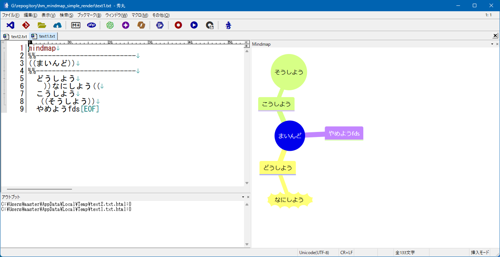
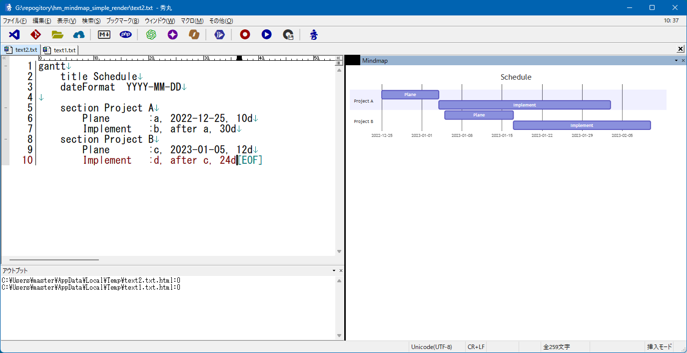

# mermaid でレンダリング可能なテキストフォーマットを レンダリング枠でレンダリングする。

mermaid でレンダリング可能なテキストを、秀丸のレンダリングペインでレンダリングします。  
テキストファイルを保存すると、レンダリングペインも更新されます。  

- ファイルを保存する際に、レンダリング枠が更新される。
- アウトプット枠に一時HTMLファイルの場所が表示されるので、該当パスをクリック(やF4キー)すれば、HTMLも開ける。

## エクササイズ

01. text1 を秀丸で開いて、HmMermaidSimpleRender.mac のマクロを実行してみましょう。  
text1 を編集して保存してみましょう。

01. text2 も同様です。

03. アウトプット枠に、作業ファイルとなるHTMLのフルパスが表示されます。  
該当のパスをクリック(やF4)などして、表示してみましょう。

## サンプルを兼ねる

「何らかのフォーマットに則ったテキスト」を「ネット上のjsライブラリを使って描画」と  
いったスタイルの最小サンプルを兼ねます。

